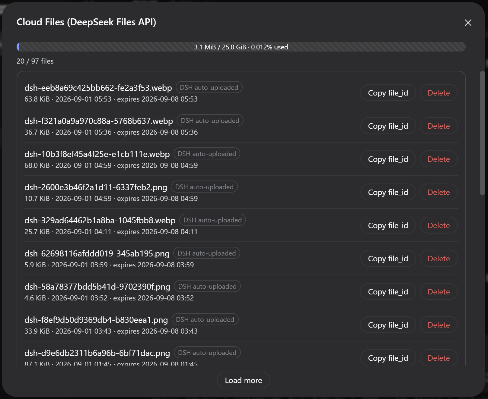

# dsh-sparrow 🐦

English | [简体中文](README.zh-CN.md) | [GitHub](https://github.com/peiyucn/dsh-sparrow)

**A collection of small DeepSeek Harness (DSH) Web plugins.**

Each plugin is published and installed independently; a plugin retires from the collection once DSH natively supports its feature.

## Install

Prerequisites: a working `dsh` CLI and `pnpm` (`dsh plugin` forwards installation to pnpm).

> The packages are published on npm, but do **not** install them with `npm install @dsh-sparrow/...` directly — that only downloads them into a `node_modules` without registering them in the DSH web profile. Use the `dsh plugin` command below so each package lands in `$DSH_HOME/profiles/web` and its bundle layer is activated. Restart DSH after installing.

## dsh-chat-suggest

Chat input suggestions. After a short typing pause, an official-@-menu-style card suggests what you may type next — Tab adopts, Esc dismisses; powered by DeepSeek FIM completion (Beta), with three trigger-sensitivity levels (high / medium / low); the completion model follows your selected main model.

> DeepSeek main models only (hidden otherwise); reuses the DeepSeek API key configured in dsh — no extra credentials.


Docs: [dsh-chat-suggest README](plugins/dsh-chat-suggest/README.md)

```bash
dsh plugin --profile web add @dsh-sparrow/dsh-chat-suggest
```

## dsh-vision-access

The official DeepSeek vision channel for text-only main models — official vision model only, no third-party models or credentials. The main model calls the `vision_read` tool, the host reads the image with the official vision model and returns a structured text report — the main model stays the brain; the tool hides itself when the main model already sees images.

> DeepSeek main models only (hidden otherwise); reuses the DeepSeek API key configured in dsh — images never leave the DeepSeek ecosystem.


Docs: [dsh-vision-access README](plugins/dsh-vision-access/README.md)

```bash
dsh plugin --profile web add @dsh-sparrow/dsh-vision-access
```

## dsh-archive-session

Archived-session management. The "Archive" entry in the sidebar backs up / deletes archived sessions (backup moves the session folder out, reversible; deletion is irreversible), and the backups area restores or deletes backups individually or in bulk.


Docs: [dsh-archive-session README](plugins/dsh-archive-session/README.md)

```bash
dsh plugin --profile web add @dsh-sparrow/dsh-archive-session
```

## dsh-nav-pin

Turn navigation that stays on narrow conversations. The official turn rail hides below a 900px conversation column; this plugin moves the breakpoint to 700px, fades the rail in as a floating overlay on hover below it (no frame, no background — same look as the wide layout), and caps the conversation content width to 120px clearance per side (640px official minimum floor) so the right drag handle no longer crowds the rail.

> Pure stylesheet injection: no toggle, no button, no settings, no persisted state; uninstalling restores the official behavior.


Docs: [dsh-nav-pin README](plugins/dsh-nav-pin/README.md)

```bash
dsh plugin --profile web add @dsh-sparrow/dsh-nav-pin
```

## dsh-file-session

DeepSeek Files API cloud file management. The "Cloud Files" entry in the sidebar lists every cloud file under your API key: cursor pagination, size / upload / expiry times, per-file deletion and one-click file_id copy. Reuses the official DeepSeekFilesClient — no extra credentials.

> The official API has no batch-delete endpoint (no "delete all") and no download endpoint (no preview); the 10000-file / 25 GiB quota is an official limit.



Docs: [dsh-file-session README](plugins/dsh-file-session/README.md)

```bash
dsh plugin --profile web add @dsh-sparrow/dsh-file-session
```

## License

MIT
