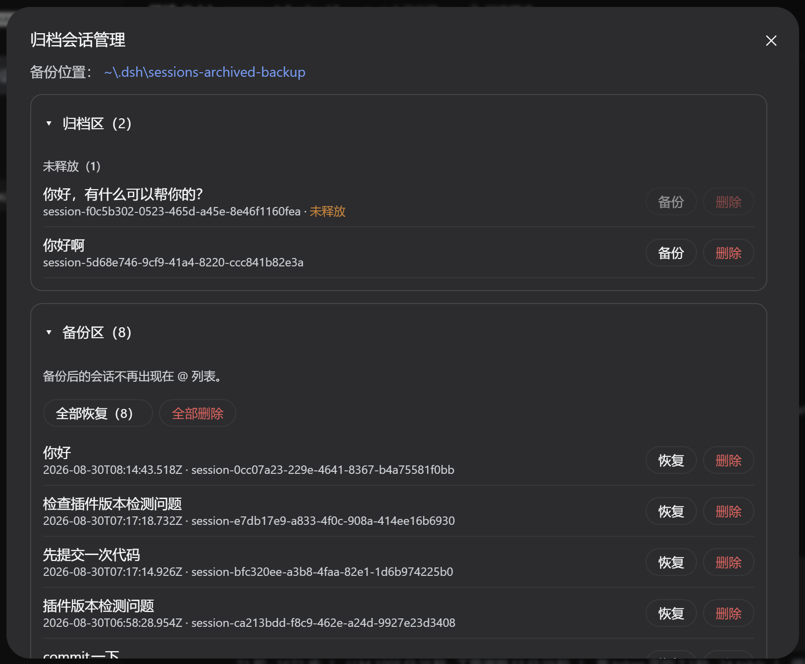

# dsh-sparrow 🐦

English | [简体中文](README.zh-CN.md) | [GitHub](https://github.com/peiyucn/dsh-sparrow)

**A collection of small DeepSeek Harness (DSH) Web plugins.**

Each plugin is published and installed independently; a plugin retires from the collection once DSH natively supports its feature.

## dsh-chat-suggest

Chat input suggestions. After a short typing pause, an official-@-menu-style card suggests what you may type next — Tab adopts, Esc dismisses; powered by DeepSeek FIM completion (Beta), with three trigger-sensitivity levels (high / medium / low); the completion model follows your selected main model.

> DeepSeek main models only (hidden otherwise); reuses the DeepSeek API key configured in dsh — no extra credentials.


Docs: [dsh-chat-suggest README](plugins/dsh-chat-suggest/README.md)

```bash
dsh plugin --profile web add dsh-chat-suggest
```

## dsh-vision-access

An image-vision channel for text-only main models. The main model calls the `vision_read` tool, the host reads the image with the official vision model and returns a structured text report — the main model stays the brain; the tool hides itself when the main model already sees images.

> DeepSeek main models only (hidden otherwise); reuses the DeepSeek API key configured in dsh — images never leave the DeepSeek ecosystem.


Docs: [dsh-vision-access README](plugins/dsh-vision-access/README.md)

```bash
dsh plugin --profile web add dsh-vision-access
```

## dsh-archive-session

Archived-session management. The "Archive" entry in the sidebar backs up / deletes archived sessions (backup moves the session folder out, reversible; deletion is irreversible), and the backups area restores or deletes backups individually or in bulk.



Docs: [dsh-archive-session README](plugins/dsh-archive-session/README.md)

```bash
dsh plugin --profile web add dsh-archive-session
```

## License

MIT
