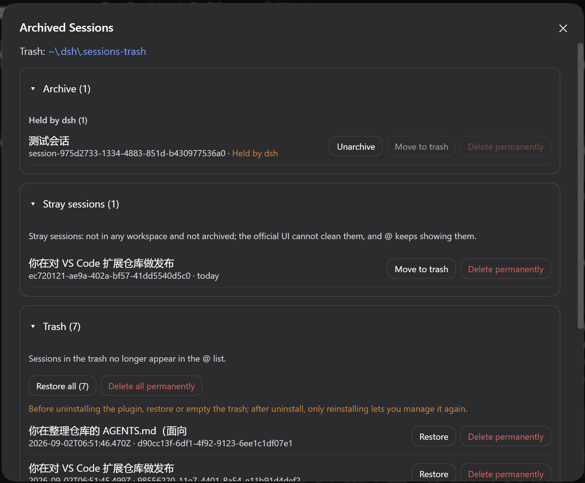

# dsh-archive-manage

English | [简体中文](README.zh-CN.md) | [GitHub](https://github.com/peiyucn/dsh-sparrow)

Archived-session management — a DeepSeek Harness (DSH) Web plugin (part of the dsh-sparrow collection).

Complements the built-in archive. DSH's archive marker only hides a session from the sidebar — the **@ mention list does not filter by the archive marker**, so archived sessions keep crowding @ candidates. This plugin adds an "Archive" entry at the bottom of the sidebar: archived sessions can be **unarchived** (back to the session list), **moved to trash** (the session directory is moved out of persistence, reversible), or **deleted permanently** (irreversible), and trash entries can be **restored** anytime — moved or deleted sessions really leave the @ list.

## Install

```bash
dsh plugin --profile web add @dsh-sparrow/dsh-archive-manage
```

Requires dsh ≥ 0.1.1-rc.2 and a working `pnpm` (`dsh plugin` forwards installation to pnpm).

> Do **not** run `npm install @dsh-sparrow/dsh-archive-manage` directly — that only downloads the package into a `node_modules` and does not register it in the DSH web profile. Install with the `dsh plugin` command above, then restart DSH.

## Usage

* **Entry**: The "Archive" button at the bottom of the sidebar opens a panel with an Archive area and a Trash area
* **Archive area**: Unarchive, move to trash, or delete permanently; permanent deletion requires typing the full session title as a strong confirmation
* **Held sessions**: Sessions opened during the current dsh run cannot have their files moved — they are grouped and greyed out in the archive area and become operable after the next dsh startup; unarchiving does not move files and works immediately
* **Trash**: Restore or delete entries individually or in bulk; sessions in the trash no longer appear in the @ list
* **Trash location**: The trash location is shown at the top of the panel; click to copy the full path

## Screenshots



## Trash Location & Restore

* Default trash folder: `$DSH_HOME/.sessions-recycle-bin/`; each entry folder contains a `dsh-archive-manage.json` recording its original location and workspace ownership, which restore uses to move it back
* The `sessions-archived-backup` folder used by earlier versions is migrated to the new folder automatically on first use; if the rename fails, the old folder keeps being used and the panel shows a warning
* Folders without a sidecar file are listed as "legacy": they can only be deleted permanently, not restored

## Uninstall & Residue

Uninstalling does **not** restore anything automatically: once the plugin is removed from DSH, its code is no longer loaded, so there is no moment for it to run — an inherent constraint of DSH's plugin mechanism. Decide the fate of your data before uninstalling:

* **Sessions in the trash**: their folders and sidecar files stay in the trash; reinstalling the plugin lets you restore or delete them again
* **Permanently deleted sessions**: irreversible, whether or not you uninstall
* **Unarchived sessions**: files were never moved — they stay in the official session list, no residue

* Before uninstalling: settle the trash in one step ("Restore all" or "Delete all permanently"), then uninstall (the panel shows a reminder while the trash is not empty)
* Already uninstalled? Reinstall the plugin to keep managing the trash (as long as sidecar files exist, restore works)
