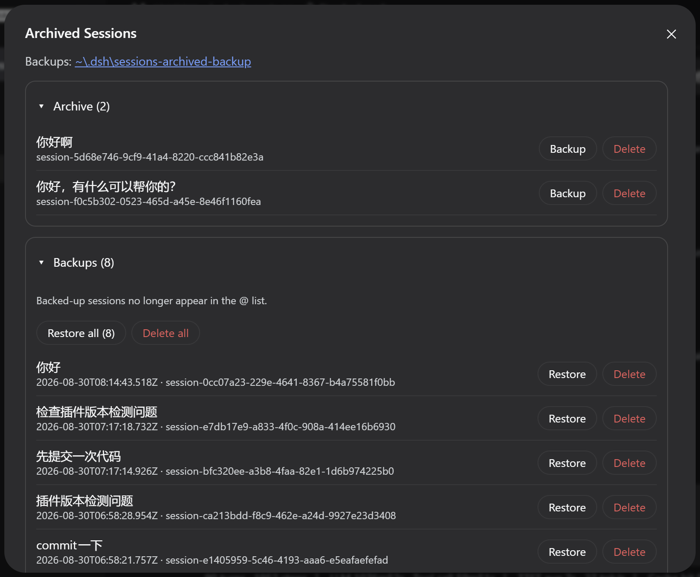

# dsh-archive-session

归档会话管理 —— DeepSeek Harness（DSH）Web 插件（dsh-sparrow 合集成员）。
Archived-session management — a DeepSeek Harness (DSH) Web plugin (part of the dsh-sparrow collection).

与官方归档互补：官方归档只把会话从侧边栏藏起来；本插件在侧边栏底部加「归档」入口，把归档会话真正**备份**（移出磁盘、可逆）或**删除**（不可逆），并可随时**恢复**。
Complements the built-in archive: DSH only hides archived sessions from the sidebar, while this plugin adds an "Archive" entry at the bottom of the sidebar to truly **back up** archived sessions (moved off disk, reversible) or **delete** them (irreversible), and **restore** them anytime.

## 安装 / Install

```bash
dsh plugin --profile web add dsh-archive-session
```

适配 dsh ≥ 0.1.1-rc.2。 · Requires dsh ≥ 0.1.1-rc.2.

## 使用 / Usage

* **入口 / Entry**：侧边栏底部「归档」按钮，弹窗分「归档区 / 备份区」两个区块
  * The "Archive" button at the bottom of the sidebar opens a panel with an Archive area and a Backups area
* **归档区 / Archive area**：对已归档会话执行「备份」或「删除」；删除需输入完整会话标题强确认
  * Back up or delete archived sessions; deletion requires typing the full session title as a strong confirmation
* **未释放会话 / Held sessions**：本次 dsh 运行中打开过的会话无法移动文件，会在归档区内分组置灰，下次启动 dsh 后才可备份 / 删除
  * Sessions opened during the current dsh run cannot have their files moved — they are grouped and greyed out in the archive area and become operable after the next dsh startup
* **备份区 / Backups area**：单个 / 全部恢复、单个 / 全部删除；备份后的会话不再出现在 @ 列表
  * Restore or delete backups individually or in bulk; backed-up sessions no longer appear in the @ list
* **备份位置 / Backup location**：面板顶部明示，点击即可复制完整路径
  * The backup location is shown at the top of the panel; click to copy the full path

## 截图 / Screenshots



## 备份位置与恢复 / Backup Location & Restore

* 默认备份夹：`$DSH_HOME/sessions-archived-backup/`；每个备份目录内含 `dsh-archive-session.json` 记录原始位置与工作区归属，恢复时按它移回
  * Default backup folder: `$DSH_HOME/sessions-archived-backup/`; each backup folder contains a `dsh-archive-session.json` recording its original location and workspace ownership, which restore uses to move it back
* 无记录文件的旧格式目录按「旧格式」列出：只能删除、不能恢复
  * Folders without a sidecar file are listed as "legacy": they can only be deleted, not restored

## 卸载与残留 / Uninstall & Residue

* **卸载不会自动恢复备份**：备份夹及其中的会话目录会保留。卸载前请先在备份区「全部恢复」；若已卸载，重装本插件即可继续恢复。
  * **Uninstalling does not restore backups**: the backup folder and the session folders inside it stay. Restore all backups before uninstalling; if already uninstalled, reinstall the plugin to restore them.
