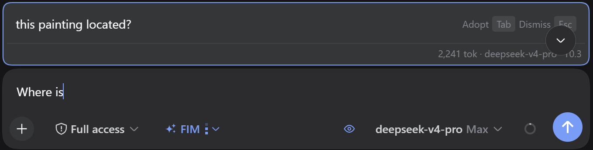

# dsh-chat-fim

简体中文 | [English](README.md) | [GitHub](https://github.com/peiyucn/dsh-sparrow)

聊天输入框续写联想 —— DeepSeek Harness（DSH）Web 插件（dsh-sparrow 合集成员）。

打字停顿片刻，输入框上方会以官方 @ 候选菜单同款悬浮卡给出「接下来可能写的文字」建议：**Tab** 采用进草稿，**Esc** 丢弃。补全由 DeepSeek 官方 FIM 补全（Beta）驱动，续写直接站在你的角度接话。

## 安装

```bash
dsh plugin --profile web add dsh-chat-fim
```

适配 dsh ≥ 0.1.1-rc.2。

## 使用

* **开关**：输入框工具行「✦ 续写」胶囊，点击开 / 关；**默认关闭**，开启状态本地记忆
* **触发**：开启后打字停顿约 0.4 秒自动联想，规则按草稿内容自适应：不足 8 字（纯英文 3 字符）、以句末标点（`。！？.!?;；`）结尾时不触发；中文草稿正停在夹入的英文单词中间时不触发；**空格后都会触发**（英文词后预测下一个词、中文空格分词续写）；拼音等输入法组合输入中不触发
* **建议**：Tab 采用、Esc 丢弃（也可直接点选）；官方 @/斜杠候选菜单打开时本建议自动让位
* **续写模型**：胶囊右侧 ▾ 可选 `auto` / `deepseek-v4-pro` / `deepseek-v4-flash`，默认 `auto` 跟随主模型；建议卡右下角显示本次续写的 tok 数与实际模型、温度
* 当前会话主模型不是 DeepSeek 系列时，开关整体隐藏
* **凭据**：续写请求复用你在 dsh 中配置的 DeepSeek API key（FIM 补全 Beta），不新增凭据、key 不进浏览器；产生的 token 计入你的 DeepSeek 账户

## 截图




## 卸载与残留

* 插件不写任何文件、不改 `.dsh` 内部结构，只做网络转发；
* 唯一的持久状态是浏览器 localStorage 键 `dsh-chat-fim:enabled`（开关）与 `dsh-chat-fim:modelMode`（续写模型档位）。卸载后这两个键留在浏览器里、无害，介意可在 DevTools 中删除。
