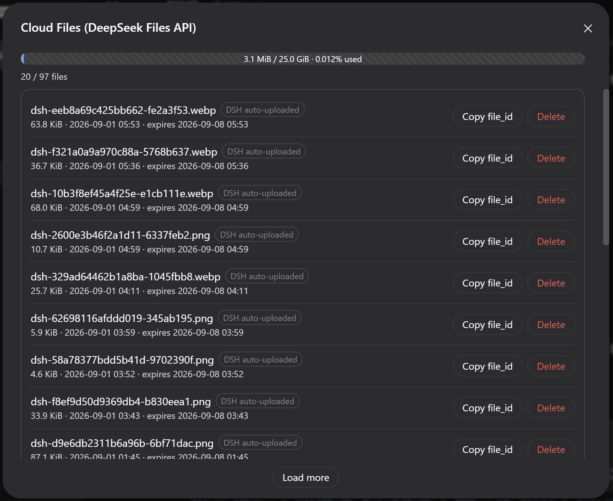

# dsh-file-manage

English | [简体中文](README.zh-CN.md) | [GitHub](https://github.com/peiyucn/dsh-sparrow)

DeepSeek Files API cloud file management — a DeepSeek Harness (DSH) web plugin (dsh-sparrow collection member).

Large images pasted into DSH are auto-uploaded to the DeepSeek Files API, but there is no official management UI. This plugin adds a "Cloud Files" entry to the sidebar and lists every cloud file under your API key: cursor pagination, upload/expiry times, sizes, single-file deletion, and one-click file_id copy. It reuses the official `DeepSeekFilesClient` — no extra credentials.

## Install

```bash
dsh plugin --profile web add @dsh-sparrow/dsh-file-manage
```

Requires dsh ≥ 0.1.2-alpha.3 (verified baseline; earlier versions unverified) and a working `pnpm` (`dsh plugin` forwards installation to pnpm).

> Do **not** run `npm install @dsh-sparrow/dsh-file-manage` directly: that only downloads the package into some `node_modules` and does not register it with the DSH web profile. Use the `dsh plugin` command above, then restart DSH.

## Usage

* **Entry**: the "Cloud Files" button at the sidebar footer
* **List**: 20 files per page with "Load more" pagination (official after cursor, newest first); each row shows filename / size / upload time / expiry time (when present)
* **Quota**: the panel header shows the total count and a netdisk-style quota bar (used storage / the official 25 GiB limit)
* **Delete**: per-row delete with confirmation; "DSH auto-uploaded" files (`dsh-` prefix) get an extra note — sessions referencing them will transparently re-upload on next use (may be slower)
* **Copy file_id**: one-click copy per row
* **Errors**: classified messages for auth failures / rate limits / server errors, with retry

## Limitations

* The official Files API has **no batch-delete endpoint** — no "delete all", only per-file deletion
* The official API has **no download endpoint** — content cannot be previewed or downloaded
* Quota: at most 10000 files / 25 GiB per key (official limits)
* **Where files come from**: DSH auto-uploads to the Files API only on the **DeepSeek model path** (the upload lives in the llm-deepseek adapter layer); with other models the list mostly shows files you or external tools uploaded
* **Expiry**: DSH auto-uploads files with a default **7-day** expiry (the official API has no permanent option); expired files are transparently re-uploaded on next use — tune `fileExpiresAfterSeconds` (1h–30d) in the `llm-deepseek` settings section

## Screenshot



## Uninstall & leftovers

* The plugin keeps no local state; uninstalling leaves the cloud files untouched and DSH behavior unchanged
