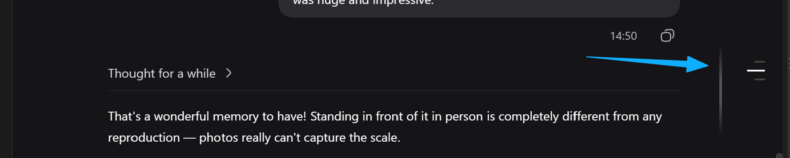

# dsh-nav-pin

简体中文 | [English](README.md) | [GitHub](https://github.com/peiyucn/dsh-sparrow)

轮次导航窄屏不消失 —— DeepSeek Harness（DSH）Web 插件（dsh-sparrow 合集成员）。

官方「轮次导航」（对话右侧跳转轮次的刻度条）在对话列窄于 900px 时会整体隐藏。本插件把断点提到 700px；700px 以下默认隐身，鼠标移到右侧导航轨道（或键盘 Tab 进入）即淡入浮现——无框无底色，与宽屏形态一致，不挤占对话空间。

## 安装

```bash
dsh plugin --profile web add @dsh-sparrow/dsh-nav-pin
```

适配 dsh ≥ 0.1.2-alpha.4，并需要可用的 `pnpm`（`dsh plugin` 会把安装操作转发给 pnpm）。

> **不要**直接执行 `npm install @dsh-sparrow/dsh-nav-pin`：那只会把包下载到某个 `node_modules`，不会注册进 DSH 的 web profile。请使用上面的 `dsh plugin` 命令安装，并在安装后重启 DSH。

## 版本兼容性

* 适配 dsh ≥ 0.1.2-alpha.4；更早版本不承诺——注入样式在最坏情况下只是匹配不到目标（空操作），不会破坏界面

## 使用

* 无需配置、无需开关：安装即生效
* 对话列 >700px：导航恒显（覆盖官方 900px 隐藏）
* 对话列 ≤700px：导航默认隐身；鼠标移到右侧边缘轨道约 120ms 淡入浮现，移出隐藏；键盘 Tab 进入导航按钮时同样浮现
* 会话内容最大宽度受限：宽列下拖到最宽右缘至少留 120px 空白（官方为 88px）；窄列下内容压到官方最小宽度 640px 让出导航余量，右侧拖拽条不再挤占轮次导航
* **注意**：官方轮次导航本身在**少于 2 个轮次时不渲染**（单轮会话没有导航可显）——这是官方行为，本插件不改变该门槛，测试时请先凑够两轮
* 卸载即恢复官方 900px 行为；无持久化状态、无残留

## 截图



## 卸载与残留

* 插件不写任何文件、不改 `.dsh` 内部结构；唯一动作是页面里注入一张样式表，随插件生命周期移除
* 无 localStorage / 无配置残留
