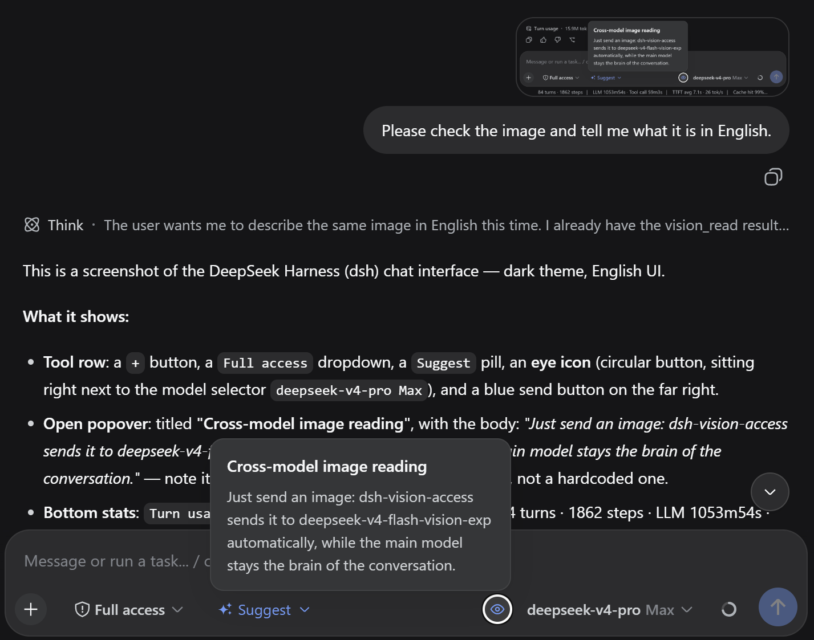

# dsh-vision-access

[中文](README.md)

An image-vision channel for text-only main models — a DeepSeek Harness (DSH) Web plugin (part of the dsh-sparrow collection).

When the main model cannot see images, it automatically calls the provided `vision_read` tool: the host reads the image with the official vision model and returns a structured text report (summary / OCR / tables / layout) — the main model stays the brain of the conversation.

## Install

```bash
dsh plugin --profile web add dsh-vision-access
```

Requires dsh ≥ 0.1.1-rc.2.

## Usage

* **Zero config**: Paste an image and just ask the main model to "look at it" — it calls `vision_read` on its own
* **Status icon**: When cross-model image reading is available for the current session (a DeepSeek text model), an eye glyph with a "Vision" label appears next to the model selector; click it for an explanation (showing which vision model handles the image); it disappears otherwise
* The tool hides itself when the main model sees images natively (e.g. deepseek-v4-flash-vision-exp) or is not a DeepSeek model — the image already reaches the model directly, so a text transcription would only degrade it
* **Credentials**: Vision calls reuse the DeepSeek API key configured in dsh; images only go to DeepSeek's official vision model and never leave the DeepSeek ecosystem — no extra credentials
* Reports are cached in-process per image + question, so repeated asks answer instantly

## Screenshots



## Uninstall & Residue

* **Zero residue**: Writes no files and never touches the `.dsh` internals; the report cache lives only in process memory and vanishes on exit.
